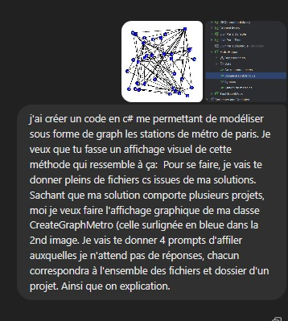
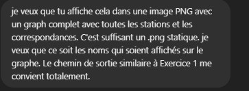

# Rapport utilisation IA

Lors du projet, nous nous sommes servis de l’intelligence artificielle ChatGPT pour plusieurs parties.

Tout d’abord, elle a servi à créer tous les fichiers CSV du dossier *Data* dans *MetroHelper*. Cette utilisation nous a permis de gagner du temps et d’obtenir les coordonnées des stations de métro, les correspondances et les différentes lignes du métro parisien de manière précise.

Exemple d’un de nos prompts pour la création des différents fichiers CSV des lignes :  
 **« Je veux que tu me crées un tableau pour chaque ligne où tu mets une colonne 'nom station de métro' et une deuxième colonne 'temps de trajet jusqu'à la prochaine station'. Tu fais deux tableaux par ligne de métro en considérant pour chacun un sens. De plus, pour la dernière station tu mets 0 en temps de trajet. Le temps de trajet n'est pas cumulatif : si tu as une station qui dessert A puis B, puis C, je veux que dans la colonne en face de la station B tu aies uniquement le temps de B \-\> C, et non le temps cumulé depuis A. »**

Pour la constitution du fichier *Correspondance.csv*, afin d’obtenir des données les plus proches de la réalité, nous avons utilisé l’option de recherche approfondie, ce qui nous a permis de produire un fichier *Correspondance.csv* aussi précis que possible.

De plus, l’usage de ChatGPT nous a été très utile pour créer les affichages des différents graphes. Nous avons ainsi généré trois images de graphes différentes avec l’aide de l’IA.  
 La classe *GrapheImageGeo*, qui permet de dessiner un graphe à partir de coordonnées, a été co-développée avec l’IA, tout comme la classe *AffichageMetro*. Il s’agissait donc d’utiliser l’intelligence artificielle pour nous aider à gérer les aspects graphiques du projet.

Les échanges avec l’IA ont été très longs. Ils se sont déroulés en trois temps.  
 Dans un premier temps, nous avons procédé à l’initialisation : nous avons expliqué à ChatGPT la finalité du code attendu, ainsi que toute l’architecture détaillée de notre projet. Nous lui avons ensuite demandé de nous poser des questions pour s’assurer qu’il comprenait bien l’ensemble de notre solution.

Puis, une fois la phase d’initialisation passé, nous avons procédé à l’affinement de la demande, nous avons demandé si il avait des Questions réponses avec ChatGpt

Une fois cette étape terminée, nous avons pu passer à la dernière phase : les corrections.  
 Il y a eu de nombreux échanges entre ChatGPT et nous, ce qui nous a permis, au final, d’obtenir un code bien coordonné avec l’ensemble de notre projet.

D’un point de vue plus général, nous avons profité d’un accès à la version premium de ChatGPT, ce qui a permis la création d’une mémoire dynamique.  
 L’IA comprenait ainsi progressivement les différents changements que nous apportions à notre code et enregistrait avec précision nos préférences en matière de développement.
